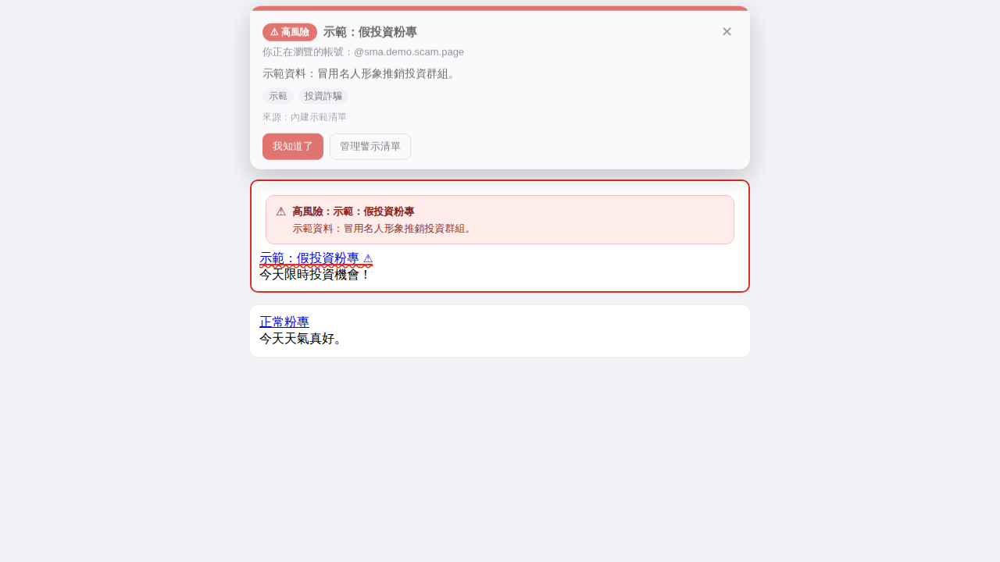

# 社群媒體警示 (social_media_alert)

瀏覽 **Facebook** 或 **Threads** 時，如果遇到自己清單裡標記過的可疑粉專或帳號，
擴充功能會在頁面頂端跳出警示橫幅，並在動態牆的貼文與連結上加註標記，
提醒你「這個帳號之前被標記過，內容請謹慎判斷」。

> 這是一個**本機清單工具**：警示來自內建清單、你自己加的項目，或你選擇訂閱的清單。
> 擴充功能本身不會判斷任何帳號是好是壞，每一筆標記都附上依據供你自行查核，
> 也不會把你的瀏覽紀錄傳到任何伺服器。



> 上圖為模擬頁面的示範畫面：頂端是警示橫幅，下方是被標記帳號的貼文標記。

## 功能

- **頁面警示橫幅**：進入被標記帳號的個人頁／粉專頁時，頂端跳出警示卡，顯示等級、原因與標籤。
- **動態牆標記**：在首頁動態、搜尋結果中，被標記帳號的貼文會加上警示條與外框，連結會加上底線與 ⚠。
- **一鍵加入清單**：在任何帳號頁面點開擴充功能圖示，填寫原因與等級即可加入。
- **四種標記等級**：高風險 / 需留意 / 提醒，以及**已澄清**（綠色提示，用來避免同名粉專被誤認，不會發出警示）。可設定最低顯示等級。
- **名稱比對**：有些粉專只查得到名稱、查不到網址代號，可以填「比對粉專名稱」，
  在帳號頁上以顯示名稱比對。這類命中會標示但書，提醒同名粉專未必是同一個。
- **清單管理**：搜尋、依平台與等級篩選、刪除、匯入／匯出 JSON。
- **訂閱清單**：填入一個回傳 JSON 的網址，定期自動同步他人維護的名單。
- **支援的比對方式**：網址代號、數字 ID、社團代號，以及粉專顯示名稱。
- **支援的網址格式**：`facebook.com/粉專名稱`、`facebook.com/profile.php?id=數字`、
  `facebook.com/people/名稱/數字`、`facebook.com/groups/社團`、`threads.net/@帳號`、`threads.com/@帳號`，
  以及貼文網址（會往回取出帳號）與 Facebook 的 `l.php` 外連跳轉。

## 安裝（開發者模式載入）

Chrome / Edge / Brave 等 Chromium 瀏覽器：

1. 下載或 clone 這個專案。
2. 打開 `chrome://extensions`（Edge 為 `edge://extensions`）。
3. 右上角開啟「**開發人員模式**」。
4. 點「**載入未封裝項目**」，選擇這個專案的根目錄（含 `manifest.json` 的那層）。
5. 打開 Facebook 或 Threads 即可開始使用。

安裝後會載入一份**內建清單**（41 筆，見下一節），可以在設定頁逐筆檢視、修改或刪除。

## 內建清單

`data/default-list.json` 收錄 41 筆整理自公開報導、被具名的粉專，分級沿用來源清冊：

| 等級 | 筆數 | 內容 |
| --- | --- | --- |
| 高風險 | 10 | 境外管理且有具名的政治操弄記錄（王宏恩 2022、DSET、無國界記者 2026/4、2022 年警方鎖定名單） |
| 需留意 | 16 | 境外或不透明訊號，未見政治操弄記錄（ENews 系列、LIFE 生活網的「我是 OO 人」等） |
| 提醒 | 10 | 同集團但非新聞輿論型的粉專 |
| 已澄清 | 5 | **同名但應排除**：臺北市政府官方的「Humans of Taipei 我是台北人」、i.Taoyuan、MyHsinchu、靠北婆婆／靠北婆家、靠北老公 |

每一筆都在 `reason` 欄位註明依據。其中 27 筆有網址代號或數字 ID，可精確比對；
另外 14 筆公開資料只留下名稱，只能用粉專顯示名稱比對，警示卡上會標明這點。

「已澄清」那 5 筆特別重要：「靠北」「我是 OO 人」在台灣本來就是常見的粉專命名，
被點名的只有其中特定幾個，其餘不能一概而論，所以把它們明確標成「與被點名對象無關」，
逛到時會顯示綠色提示而不是警示。

清單檔也記錄了**已知缺口**（`gaps` 欄位）：靠北系列其餘未具名者、王宏恩／林雨蒼未公開名稱的
「台灣」系列、2026 年 6 月洗版的 163 個與 2022 年 25 個中的另外 20 個、「我是 OO 人」其餘 17 縣市。
這些公開領域沒有名稱，清單裡也就沒有。

更新內建清單後，已經安裝過的使用者可以到設定頁按「**重新載入內建清單**」補進新項目
（已存在的會自動略過，自己新增的不會被動到）。

## 檢舉頁面（GitHub Pages）

`site/` 是一個對外公開的檢舉頁，任何人都可以回報有輿論操弄疑慮的粉專：

- **檢舉表單**：自動解析粉專網址取出代號、檢查必填欄位，再把內容整理成一則預填好的
  GitHub Issue（附帶給維護者的查證檢核清單）。沒有 GitHub 帳號的人可以改用「複製內容」。
- **收錄標準**：頁面上明列會查證的訊號與**不會收錄**的情況（立場不同、個人帳號、
  無依據的猜測、私人恩怨、同名整批指認）。
- **目前清單**：直接讀 `data/default-list.json`，可搜尋與依等級篩選，並列出已知缺口。
- **申訴管道**：粉專經營者可提出更正，結果分為移除、改標為「已澄清」、或維持並補充說明。

沒有後端、沒有 Cookie、不做追蹤——所有動作都在瀏覽器本機完成，送出即是開一則公開 Issue。

### 啟用

1. GitHub repo → **Settings → Pages → Source** 選 **GitHub Actions**。
   這一步只能手動做，workflow 自己做不到——`GITHUB_TOKEN` 沒有建立 Pages 站台的權限。
2. 把分支合併進 `main`（或到 Actions 頁手動執行「部署檢舉頁到 GitHub Pages」）。
3. 網址為 `https://<你的帳號>.github.io/social_media_alert/`。

如果部署失敗在 `configure-pages` 並顯示 `Get Pages site failed ... Not Found`，
就是第 1 步還沒做；設定完再到 Actions 頁重跑一次即可。

`data/default-list.json` 或 `src/common/matcher.js` 有更動時會自動重新部署，
網站與擴充功能共用同一份資料，不會有兩份清單不同步的問題。

### 本機預覽

```bash
npm run site:serve   # http://localhost:8080
```

### 查證流程

維護者收到檢舉後的判斷標準寫在 [docs/review-process.md](docs/review-process.md)：
可查證性檢核 → 排除不收的情況 → 決定等級 → 寫進清單 → 回覆結案。

## 使用方式

### 把帳號加入警示清單

- **方法一**：在該帳號／粉專頁面點擴充功能圖示 → 填寫名稱、等級、原因 → 「加入警示清單」。
- **方法二**：設定頁 →「新增警示帳號」→ 直接貼上帳號名稱或完整網址。

### 調整提醒方式

設定頁（擴充功能圖示 →「管理清單與設定」）可以調整：

| 設定 | 說明 |
| --- | --- |
| 啟用警示功能 | 總開關，關閉後不做任何比對 |
| 頂端警示橫幅 | 進入帳號頁時是否跳出警示卡 |
| 動態牆標記 | 是否在貼文與連結上加註 |
| 貼文外框 | 被標記的貼文是否加上彩色外框 |
| 最低顯示等級 | 例如設成「只顯示高風險」，就不會被低等級標記打擾 |

### 清單格式

匯出／訂閱使用同一種 JSON 格式：

```json
{
  "name": "my-list",
  "version": 1,
  "entries": [
    {
      "platform": "facebook",
      "handle": "some.page",
      "name": "假投資粉專",
      "level": "danger",
      "reason": "冒用名人形象推銷投資群組",
      "tags": ["投資詐騙"]
    },
    {
      "platform": "facebook",
      "nameMatch": ["只查得到名稱的粉專"],
      "level": "warning",
      "reason": "沒有網址代號，只能用顯示名稱比對"
    },
    {
      "platform": "facebook",
      "handle": "same.name.but.different",
      "level": "safe",
      "reason": "已查核：與上面被點名的粉專無關，不要搞混"
    }
  ]
}
```

欄位說明請見 [docs/list-format.md](docs/list-format.md)。

## 開發

```bash
npm test          # 執行網址解析與比對的單元測試
npm run check     # 檢查所有 JS 檔語法
npm run build     # 打包成 dist/social-media-alert-<版本>.zip（需要 zip 指令）
npm run site      # 組出檢舉頁要用的資料（site/data、site/lib）
npm run site:serve  # 本機預覽檢舉頁
```

專案結構：

```
manifest.json              擴充功能設定（Manifest V3）
src/common/matcher.js      網址解析與清單比對（共用）
src/common/storage.js      chrome.storage 封裝（共用）
src/content/               注入頁面的比對與警示 UI
src/background/            service worker：示範清單、徽章、訂閱更新
src/popup/                 工具列彈出視窗
src/options/               設定與清單管理頁
data/default-list.json     安裝時載入的內建清單（網站與擴充功能共用）
site/                      對外公開的檢舉頁與隱私權政策（GitHub Pages）
store-assets/              Chrome 線上應用程式商店的截圖與宣傳圖磚
docs/chrome-store.md       上架指南（文案、權限理由、審查注意事項）
docs/review-process.md     維護者的查證流程
.github/ISSUE_TEMPLATE/    檢舉與申訴的 Issue 範本
test/                      單元測試
```

## 上架 Chrome 線上應用程式商店

素材與逐步說明都準備好了：

- **上架指南**：[docs/chrome-store.md](docs/chrome-store.md) —— 商店文案、權限理由、
  隱私權聲明填法、審查常見問題，多數欄位可直接複製貼上。
- **圖形素材**：`store-assets/` —— 5 張 1280×800 截圖與 1 張 440×280 宣傳圖磚。
- **隱私權政策**：https://mark780825.github.io/social_media_alert/privacy.html
- **套件**：`npm run build` 產生 `dist/social-media-alert-<版本>.zip`。

需要一次性的 5 美元開發者註冊費。建議先以「未列出」發布，確認沒問題再轉公開。

## 隱私

- 所有清單與設定都存在瀏覽器本機的 `chrome.storage.local`。
- 擴充功能只在 `facebook.com`、`threads.net`、`threads.com` 執行。
- 只宣告 `storage` 與 `alarms` 兩個權限；**不使用 `tabs` 權限**，因此讀不到其他分頁的網址。
- 唯一的對外連線是**你自己填寫的訂閱清單網址**；沒有填就完全不連外。
- 不蒐集、不上傳任何瀏覽紀錄或個人資料。

## 免責聲明

內建清單整理自公開報導中被具名的粉專，並在每一筆註明依據；分級沿用來源清冊的判斷。
標記僅供個人查核參考，**不構成對任何粉專、公司或個人的事實認定**，也不代表本專案的立場。
特別注意：以名稱比對的項目可能對到同名的其他粉專，請先確認粉專的透明度資訊再做判斷。
請避免用來散布不實指控；使用者自行增修的清單內容，由使用者自行負責。

## 授權

MIT License，詳見 [LICENSE](LICENSE)。
